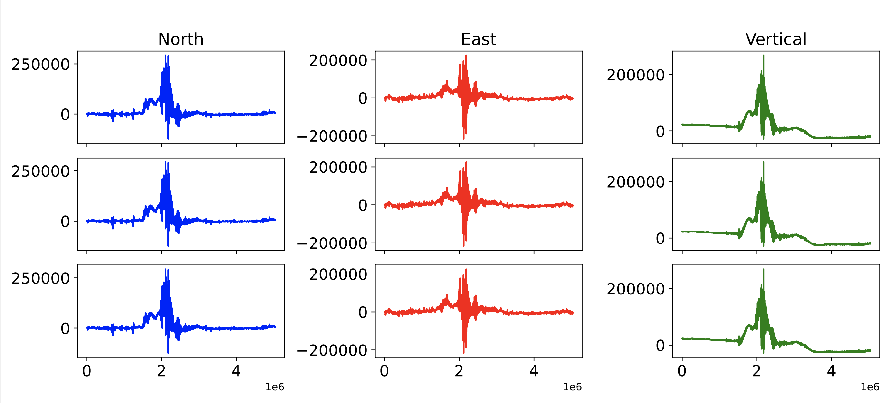
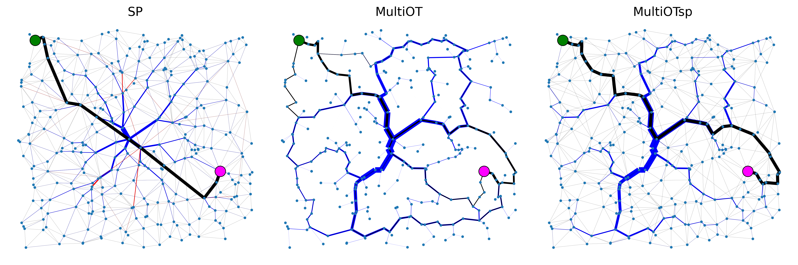
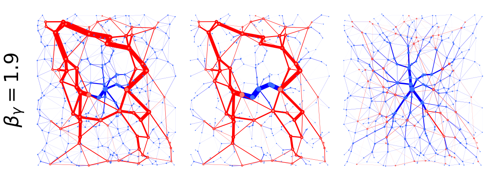

# Hi there, 

I'm Abdul or @aadinoyiibrahim:

 - PhD in Computer Science from Max Planck Institute for Intelligent Systems and University of Tübingen, Germany, specializing in routing optimization and sustainability

 - Expertise in machine learning, network flow optimization, data science, and algorithm development. Proficient in Python and associated libraries, with skills in visualization, model deployment, and cloud computing

 - Here are some highlighted projects:
    - waveform amplitude prediction

    

     
    

    - Optimal transport in networks
    

     
     
    

My research codes are available on GitHub. You can find direct links to the relevant repositories at the end of each published paper.

For any inquiries, please contact me at abdullahi.ibrahim[at]tuebingen.mpg.de.