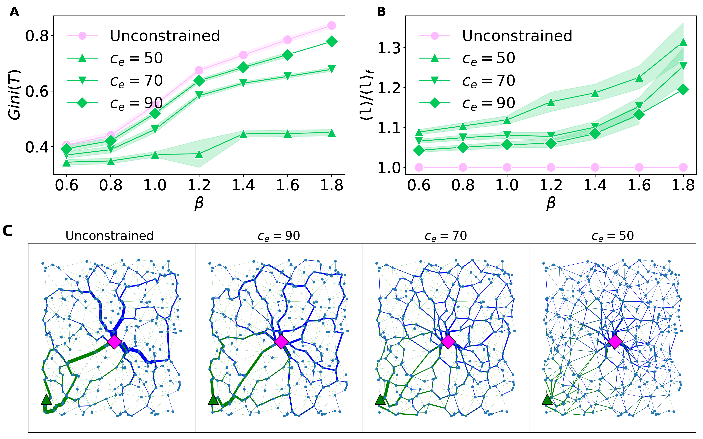

# Hi there, 

I'm Abdul or @aadinoyiibrahim:

 - PhD in Computer Science from Max Planck Institute for Intelligent Systems and University of Tübingen, Germany, specializing in routing optimization and sustainability

 - Expertise in network flow optimization, data science/AI, and algorithm development. Proficient in Python and associated libraries, with skills in visualization, model deployment, and cloud computing

## Here are some highlighted projects:

### 1. Adaptation equation, Optimal transport, routing optimization, network science, ML

 - a. [Optimal transport in multilayer transport networks](https://github.com/cdebacco/MultiOT): 
 Traffic congestion is one of the major challenges faced by the transportation industry. While this problem carries a high economic and environmental cost, the need for an efficient design of optimal paths for passengers in multilayer network infrastructures is imperative. We propose an algorithm that uses Optimal Transport theory to extract optimal paths in multilayer transport networks.

    

     
    

- [Optimal transport with Constraints](https://github.com/aadinoyiibrahim/VECOTRA):
In standard OT methods (i.e., see 1.a above), beyond few obvious constraints (e.g., conservation of mass), the amount of flow passing through an edge of the transportation network is unconstrained. As a result, traffic tends to concentrate on path trajectories that may be structurally unfeasible. This Letter proposes an approach to avoid this crucial flaw of OT models by imposing constraints. Applying this approach significantly impacts the overall network topology induced by the optimal flows, as the resulting path trajectories have different path lengths and traffic distribution than those obtained from unconstrained scenarios (in 1.a above).

     

### 2. Deep learning & NLP

### 3. Data science  

    - waveform amplitude prediction

    

     
    

My research codes are available on GitHub. You can find direct links to the relevant repositories at the end of each published paper.

For any inquiries, please contact me at abdullahi.ibrahim[at]tuebingen.mpg.de.
