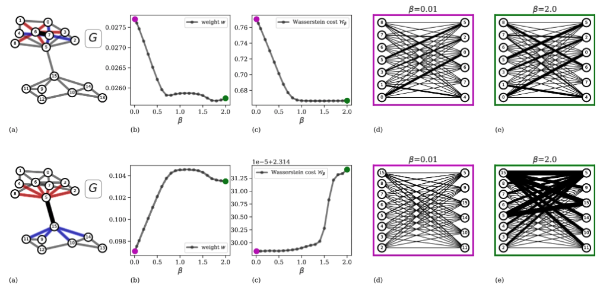
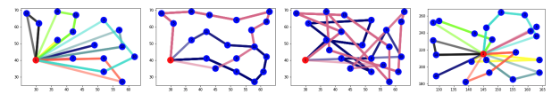
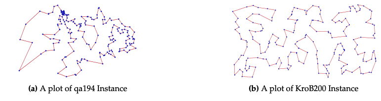
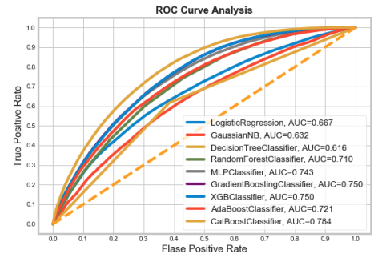
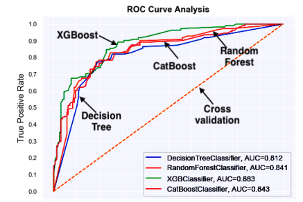

# Hi there, 

I'm Abdul, I hold a PhD in Computer Science from Max Planck Institute for Intelligent Systems and University of Tübingen, Germany.

## Here are some highlighted projects:

### 1. Adaptation equation, Optimal transport, routing optimization, network science, ML

 - a). [Optimal transport in multilayer transport networks](https://github.com/cdebacco/MultiOT): 
 Traffic congestion is one of the major challenges faced by the transportation industry. While this problem carries a high economic and environmental cost, the need for an efficient design of optimal paths for passengers in multilayer network infrastructures is imperative. We propose an algorithm that uses Optimal Transport theory to extract optimal paths in multilayer transport networks.

    

     
    

- b). [Optimal transport with Constraints](https://github.com/aadinoyiibrahim/VECOTRA):
In standard OT methods (i.e., see 1.a above), beyond few obvious constraints (e.g., conservation of mass), the amount of flow passing through an edge of the transportation network is unconstrained. As a result, traffic tends to concentrate on path trajectories that may be structurally unfeasible. This Letter proposes an approach to avoid this crucial flaw of OT models by imposing constraints. Applying this approach significantly impacts the overall network topology induced by the optimal flows, as the resulting path trajectories have different path lengths and traffic distribution than those obtained from unconstrained scenarios (in 1.a above).

     

- c). [ORC-Nextrout](https://github.com/danielaleite/orc-nextrout): 
The ORC-Nextrout algorithm is designed to recover community structures in networks. We do this by taking inspiration from recent approaches that connect community detection with geometry, using the notion of Ollivier-Ricci curvature (ORC) to detect communities, and combining with a recent Optimal Transport (OT) approach that allows tuning for traffic penalization.

     

- d). [Capacitated vehicle routing problem](https://pisrt.org/psrpress/j/odam/2020/1/8/capacitated-vehicle-routing-problem-with-column-generation-and-reinforcement-learning-techniques.pdf):
Our goal is to find optimal set of routes for some vehicles delivering goods or services to
some known locations, and without exceeding the capacity. To address this; we formulated a mathematical model for the CVRP problem, develop a reinforcement learning framework for solving CVRP, and
compare the optimal gap between column generation, Google’s operations research tools and reinforcement
learning.

     

- e). [Traveling Salesman problem](https://pisrt.org/psrpress/j/odam/2019/3/4/a-comparative-analysis-of-the-travelling-salesman-problem-exact-and-machine-learning-techniques.pdf):
 TSP describes a salesman who must travel through n cities. Our goal is to develop a machine learning algorithm to solve TSP and compare the solution exact method to determine the optimal gap. To achieving this, we develop a mathematical formulation for TSP, develop a machine learning algorithm, and apply this method on solving large size problem.

 

     

### 2. Data science, Deep learning & NLP

- a). [Brain Tumor MRI Scans dataset](https://github.com/aadinoyiibrahim/brain-tumor-analysis-with-densenet): 
The task was to classify MRI images to different types of conditions or tumors related to the brain and surrounding tissues. The specific goal is to develop a convolutional neural network model to detect whether an MRI brain image is glioma, meningioma, pituitary or healthy. To address this, I implemented two variants of the DenseNet model to classify these images. To ensure better understanding of the model's performance, two evaluation techniques were implemented: the \underline{loss of Epochs and accuracy}. The models were able to accurately classify brain tumor MRI scans with high accuracies of $0.94$ and $0.96$. %Details of these projects can be accessed on my GitHub page.

     

- b). [Semantic NLP Filtering for Deep Learning Papers in Virology/Epidemiology](https://github.com/aadinoyiibrahim/SemanticNLP): The task is to filter and classify academic papers from a dataset created through a keyword-based search on PubMed. The specific goal is to identify papers that implement deep learning neural network-based solutions in the fields of virology and epidemiology. In the filtering process for relevant papers, I employed a combination of NLP techniques, leveraging embedding models—specifically, DistilBERT—to represent the textual content of the papers in a dense vector space. This approach allows for capturing semantic meanings and contextual relationships within the text, going beyond keyword matching. Additionally, I used lemmatization to standardize the terms used in the papers, reducing variations in word forms (e.g., "analyze" vs. "analyzing") and improving the effectiveness of the filtering.

     

 

- c). waveform amplitude prediction

     

- d). [Comparison of the CatBoost Classifier with other
Machine Learning Methods](https://thesai.org/Downloads/Volume11No11/Paper_90-Comparison_of_the_CatBoost_Classifier.pdf):  
We carry out data clearning on some real data. Then compared the
algorithm’s performance of some classifiers.

     

- e). [Analysis of Titanic Disaster using Machine Learning Algorithms](https://scholar.google.com/citations?view_op=view_citation&hl=en&user=2r75Y_UAAAAJ&citation_for_view=2r75Y_UAAAAJ:L8Ckcad2t8MC):  
we explored the Titanic data and four machine learning algorithms namely XGBoost, CatBoost, Decision trees, Random forests were implemented to predict survival rate of passengers. Some factors such as" Age"," Gender"," Children" played a key role towards the survival of Passengers. 

     

My research codes are available on GitHub. You can find direct links to the relevant repositories at the end of each published paper.

For any inquiries, please contact me at abdullahi.ibrahim[at]tuebingen.mpg.de.
